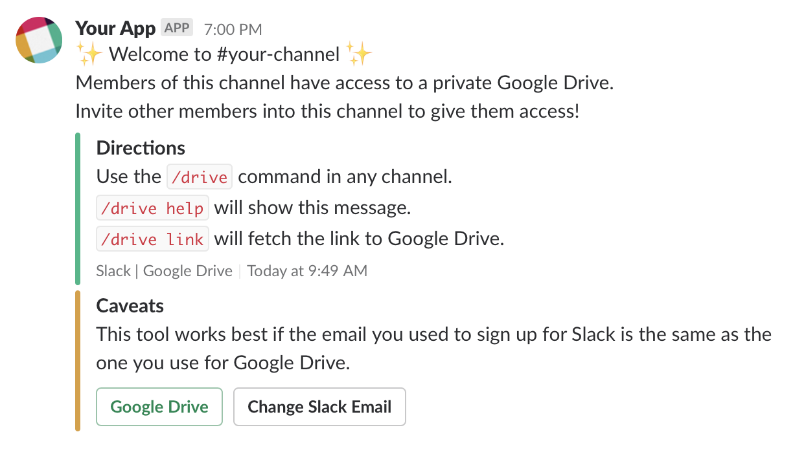
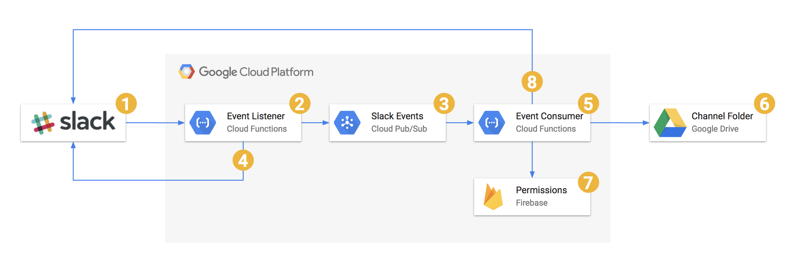

Share Google Docs by email using Slack channels and Google Drive.

## Overview

This application aims to provide Slack teams with a private folder in Google Drive for each channel in the workspace. Members of each channel are given access to the channel's folder using the email address associated with his/her Slack account. This function aims to reduce the use of to Google Docs' "_share by link_" feature because it is inherently insecure.

Team members are added as collaborators simply by joining the channel or by initiating a custom slash command within said channel. Leaving a channel will remove the user from the set of collaborators for that channel's files in Google Drive.

Users can be explicitly _excluded_ (like bots) or _included_ (for beta-testing, perhaps) from consideration using a [configuration](./config.example.json) file, where the access keys and other configuration options are stored.

## Architecture

This application makes use of “serverless” architecture to interact with a Slack bot through Slack’s Web & Events API using slash commands and event subscriptions. In toto, four cloud functions comprise the application’s core functionality: three HTTP endpoints and one subscription-based event processor.

Google Cloud is a natural back-end for this application and the docs have been written with that assumption, but there is no reason the concepts cannot be applied to another back-end, like AWS.

View the [architecture](https://github.com/amancevice/slack-drive/blob/master/docs/arch.md) docs to see how this app works in detail.

## Setup

Some assembly required...

### Slack Bot

A Slack Bot is required to act as the interface between your infrastructure and Slack Users.

View the [docs](https://github.com/amancevice/slack-drive/blob/master/docs/slack.md) for step-by-step instructions on configuring your Slack app.

### Google Cloud

_This section is under development..._

Sign into [Google Cloud](https://cloud.google.com) to start using Google's cloud infrastructure.

View the [docs](https://github.com/amancevice/slack-drive/blob/master/docs/cloud.md) for step-by-step instructions on configuring Google Cloud.

## Deployment

The simplest way to deploy this app is to use [Terraform](https://www.terraform.io). A [terraform module](https://registry.terraform.io/modules/amancevice/slack-drive/google) is provided to help deploy the supporting infrastructure for this application.

### Configuration

Head to the [releases](https://github.com/amancevice/slack-drive/releases) page of this repo and download the latest package, titled `slack-drive-x.y.z.zip`.

Unzip the archive and view the `README` file in it. It should instruct you to:

1. Download `client_secret.json` from the Google Cloud console into the package directory.
2. Run `terraform init` to download the deployment modules.
3. (Optional) Update config.tpl with any additional values.
4. (Optional) Update variables in `terraform.tf` with the correct values.
5. Record required variables into `terraform.tfvars`.
6. Or, simply enter them on the command line in step 7.
7. Run `terraform apply` to view, approve, and deploy the Slack Drive infrastructure.
8. Take note of the output URLs to finish setting up your Slack App.
