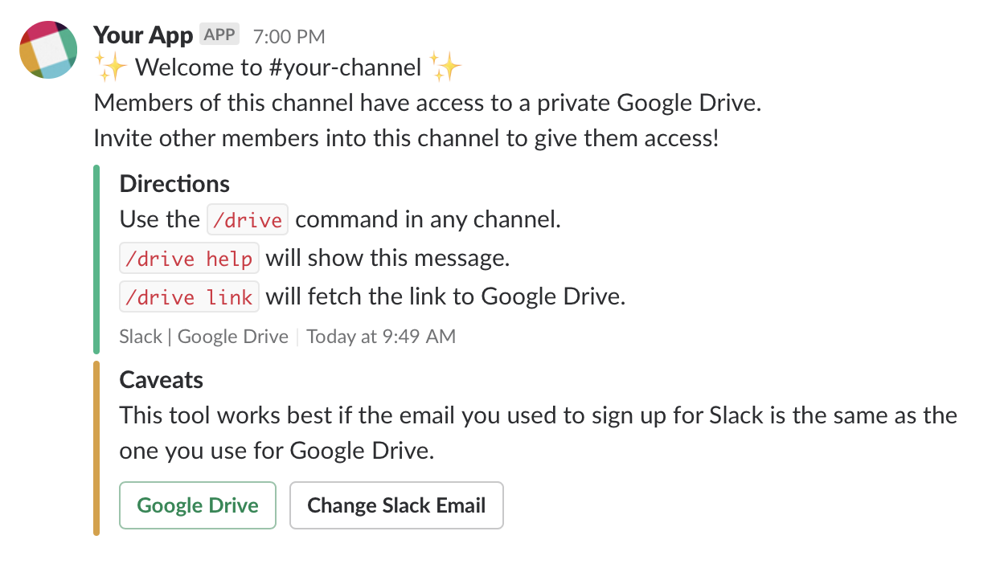
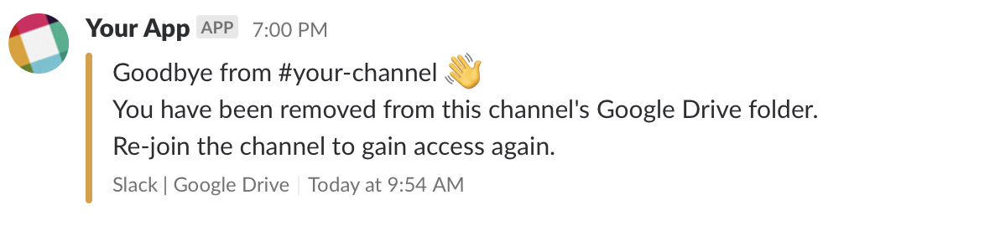

# Architecture

This application makes use of “serverless” architecture to interact with a Slack bot through Slack’s Web & Events API using slash commands and event subscriptions. In toto, four cloud functions comprise the application’s core functionality: three HTTP endpoints and one subscription-based event processor.

Google Cloud is a natural back-end for this application and this document is written with that assumption, but there is no reason the concepts cannot be applied to another back-end, like AWS.

### Events

The above diagram illustrates the flow of data when a Slack event occurs.

#### 1. Event Emitted

Slack's [Events API](https://api.slack.com/events-api) issues events on a subscription basis; you must configure your Slack app to subscribe to four event types:
* `channel_rename` and `group_rename` are sent when a user renames a channel (including private channels)
* `member_joined_channel` when a member joins a channel
* `member_left_channel` when a member leaves a channel

Slack will send the event payloads to an HTTP endpoint.

#### 2. Event Received

Slack events are handled using an HTTP endpoint backed by a [Google Cloud Function](https://cloud.google.com/functions/) (similar to an AWS Lambda). Slack imposes a three-second time limit for responses to requests made by Slack, so it is vital that this function be slim and speedy.

The HTTP endpoint function simply verifies that the request was received with the correct validation token, then publishes the event.

#### 3. Event Published

Google's [Pub/Sub](https://cloud.google.com/pubsub/) service acts as middleware for processing the events. Messages to Pub/Sub are Base64-encoded JSON strings of the Slack event as they are transmitted by Slack's Events API.

#### 4. Response Sent

Once the event has been successfully published to Pub/Sub, the function responds to the initial request with a 200 OK response.

#### 5. Event Consumed

Publishing to a Pub/Sub topic triggers a subscribed Cloud Function to process the event without regard for HTTP latencies or cold start time.

Using Slack's [Web API](https://api.slack.com/web) the Channel and User info is gathered to be translated into a request to Google Drive.

#### 6. Google Drive Modified

Channel or group renames trigger an update to rename the corresponding folder in Google Drive.

Members joining a channel are processed by searching-for or creating a folder in Google Drive with the equivalent channel name, and adding the user to the list of collaborators for that folder.

Members leaving the channel are removed from the list of collaborators for the folder and , hence, lose access to its contents.

#### 7. Permissions Recorded

The Google Drive REST API does not expose functionality to search for permissions on a file in Google Drive by email. As such it is necessary to keep records of granted permissions so that they can be revoked later.

Because of the highly simplistic nature of the data, Firebase's [Realtime Database](https://firebase.google.com/products/realtime-database/) is a reasonable solution to managing this problem.

#### 8. Slack Message Posted

When a member joins a channel, an ephemeral message is posted back to the user with a link to the channel folder in Google Drive as well as general info about the Slack Drive app.

A member leaving a channel receives a DM from the Slack bot indicating that their access to Google Drive has been removed for that channel.

Additionally, a logging message is posted to a (preferably private) channel for the Slack admins to monitor. This is also where any errors would be posted if something goes wrong in the workflow.

##### Member Joined Channel

##### Member Left Channel

##### Success

##### Error

### Slash Commands

The above diagram illustrates the flow of data when a user issues a slash command in Slack.

#### 1. Slash Command Issued

In addition to listening for events, a user may trigger the workflow to access a channel’s folder in Google Drive using Slack’s slash commands feature.

#### 2. Slash Command Received

Outgoing slash commands are handled similarly to events using an HTTP endpoint backed by a Cloud Function.

#### 3. Response Sent

Slack also imposes a three-second time limit on responses to user-initiated slash commands, so like the event listener Cloud Function, the slash command code is minimal and handles no responsibilities other than responding to the user. The name of your slash command is configurable, but the default is `/drive`.

Typing `/drive` or `/drive help` from a given channel will send an ephemeral message to the user with instructions on how to use the tool.

Typing `/drive link` will send an ephemeral message to the user with a link to the channel’s folder in Google Drive.

#### Link

#### 4. Link Requested

Because of the aforementioned three-second rule the link to Google Drive is routed through a different Cloud Function that grants access to the requesting user in real-time, but without a strict time limit.

#### 5. Link Redirected

Like the event consumer Cloud Function, the process of redirecting the user is done by searching-for or creating the channel’s folder in Google Drive, adding the Slack user as a collaborator by email, and finally redirecting the request to the given Google Drive URL. The redirection HTTP endpoint accepts the query parameters `channel` and `user`. The given user must be a member of the given channel at the time of the request for the redirection to succeed.

#### 6. Google Drive Modified

As above, members in a channel are processed by searching-for or creating a folder in Google Drive with the equivalent channel name, and adding the user to the list of collaborators for that folder.

With all the Google Drive requests handled, the user is then redirected to the private URL for the channel folder.

#### 7. Permissions Recorded

Again, as above the Google Drive REST API does not expose functionality to search for permissions on a file in Google Drive by email. As such it is necessary to keep records of granted permissions so that they can be revoked later.
