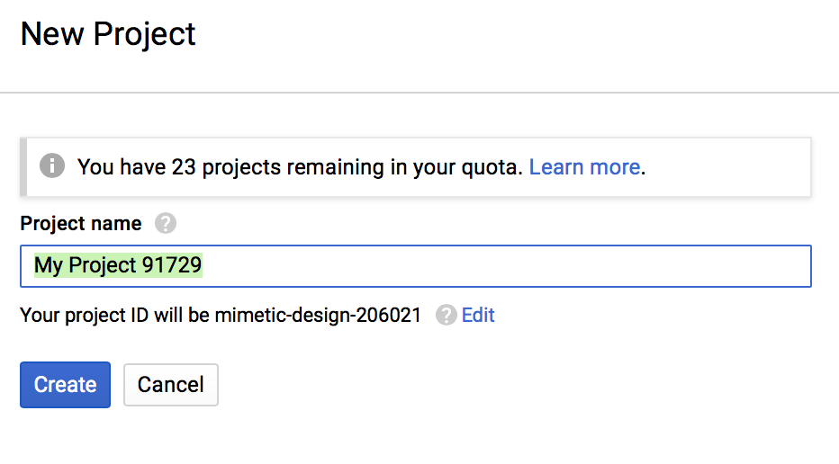
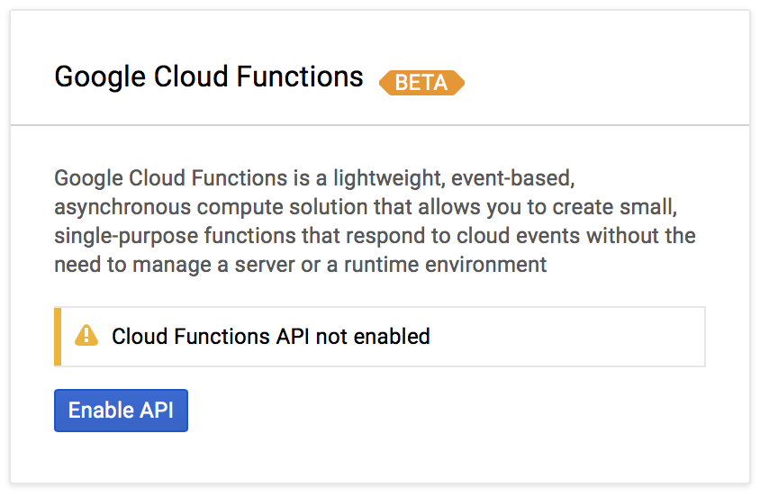
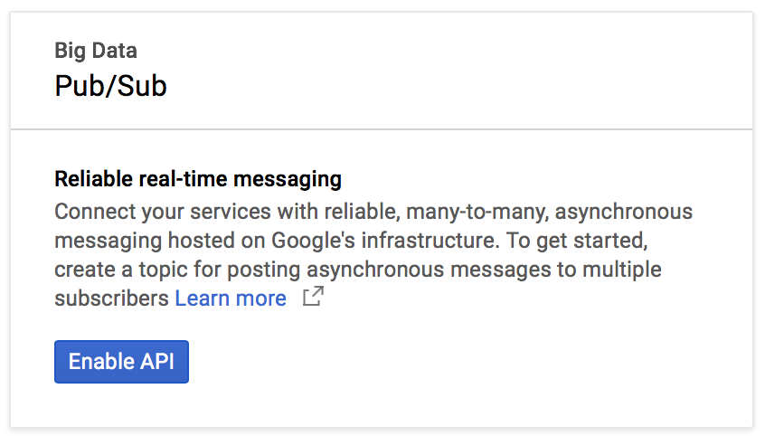
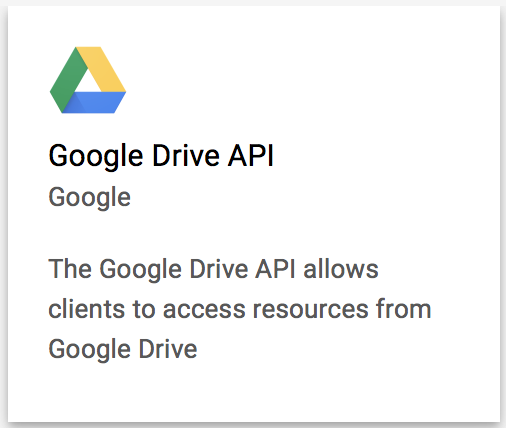
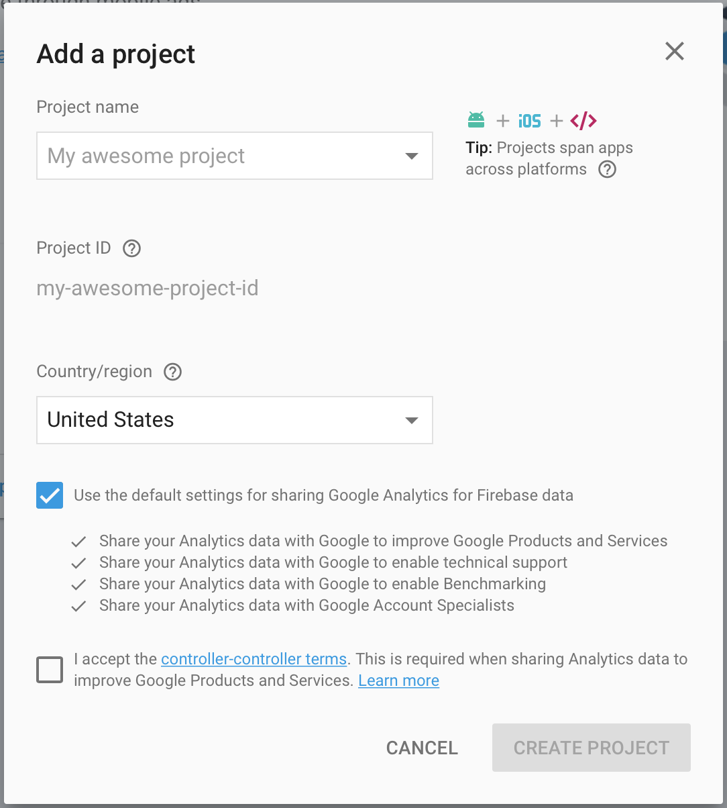
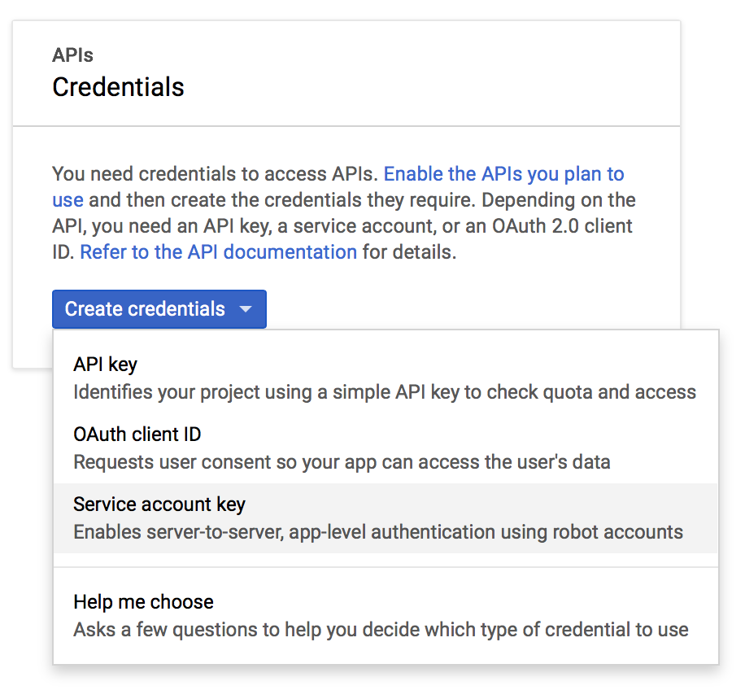
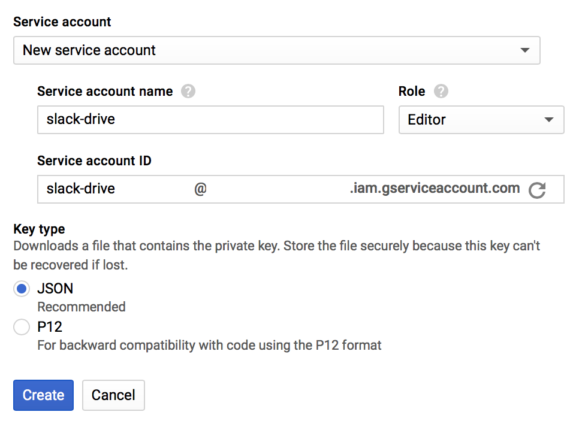

# Google Cloud

_This section is under development..._

These instructions will guide you through creating a [Google Cloud Project](https://cloud.google.com/resource-manager/docs/creating-managing-projects) to serve as your back end and enable the necessary APIs.

## Create Project

The first step in setting up Slack Drive is to [create a new project](https://console.cloud.google.com/projectcreate) in the Google Cloud console. Enter a name for your project and click _‹‹ Create ››_.

</img>

## Enable Cloud Functions API

Use the left-hand menu to navigate to [Cloud Functions](https://console.cloud.google.com/functions) and click _‹‹ Enbable API ››_.

</img>

View the docs on [Cloud Functions](https://cloud.google.com/functions/).

## Enable Pub/Sub API

Use the left-hand menu to navigate to  [Pub/Sub](https://console.cloud.google.com/cloudpubsub) and click _‹‹ Enable API ››_.

</img>

View the docs on [Pub/Sub](https://cloud.google.com/pubsub/).

## Enable Google Drive REST API

Use the left-hand menu to navigate to [APIs & Services](https://console.cloud.google.com/apis/). Click _‹‹ ENABLE APIS AND SERVICES ››_. Search for "Google Drive", click on the Drive card and then click the _‹‹ ENABLE ››_ button.

</img>

## Enable Firebase Realtime Database

_This section under development..._

Navigate to the [Firebase Console](https://console.firebase.google.com) and add use the dropdown menu to add your Google Cloud project. Change any sharing settings you want and click the _‹‹ CREATE PROJECT ››_ button.

</img>

Use the left-hand menu to go to the database section of the console and set up your database.

View the docs on Firebase's [Realtime Database](https://firebase.google.com/docs/database/).

## Create Service Account

In order to access Google Cloud services you will need to create a service account that has edit access for the project.

Use the left-hand menu to navigate to the [credentials](https://console.cloud.google.com/apis/credentials) section of the [APIs & Services](https://console.cloud.google.com/apis/) menu item.

Click the _‹‹ Create credentials ››_ button and then choose "Service account key".

</img>

Fill in the form, choosing the "Editor" role and click _‹‹ Create ››_.

</img>

Download its access keys in order to deploy the infrastructure.

View the docs on [Service Accounts](https://cloud.google.com/iam/docs/service-accounts)
