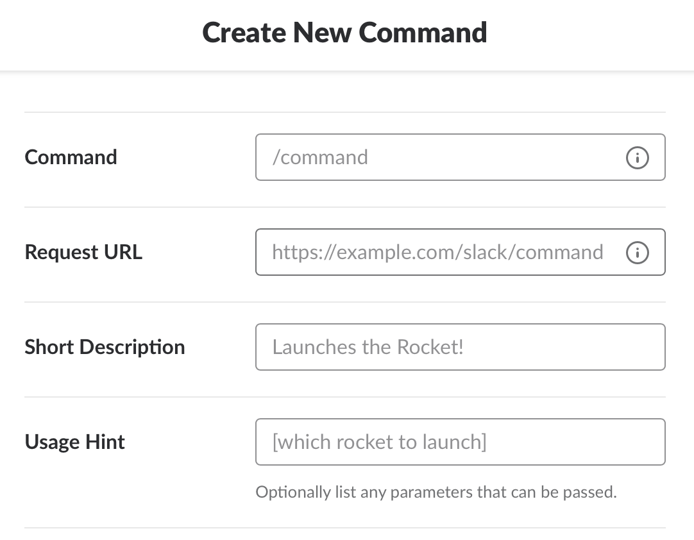

# Slack Bot

These instructions will guide you through creating a Slack bot that will handle sending events and slash commands to your back end.

## Create An App

Navigate to [api.slack.com/apps](https://api.slack.com/apps) and click the _‹‹ Create New App ››_ button.

</img>

Fill the dialog with an App Name and choose a workspace for the app. You will need to be an administrator of the workspace you choose.

</img>

## API & Verification Tokens

After installing the app to your workspace, navigate to the **OAuth & Permissions** section of the left-hand menu, grab the _Bot User OAuth Access Token_.

Next, select **Basic Information** from the left-hand menu and grab the _Verification Token_.

Store these values in the `terraform.tfvars` file of the install package.

```terraform
# terraform.tfvars
web_api_token      = "my-web-token",
verification_token = "my-verification-token"
```

## Bot User

From the left-hand menu, choose **Bot Users** and click the _‹‹ Add a Bot User ››_ button.

Fill in the the form with a _Display name_ and _Default username_ and click the _‹‹ Add a Bot User ››_ to finish the workflow.

</img>

## OAuth & Permissions

Choose **OAuth & Permissions** from the left-hand menu and scroll down to the **Scopes** section. You should see the `bot` scope pre-populated in the _OTHER_ section of the permissions view.

In the _Select Permission Scopes_ dropdown add permissions for:

- `channels:read`
- `groups:read`
- `users:read`
- `users:read.email`

</img>

This will allow your app to retrieve channel names & user emails from Slack IDs using Slack's [Web API](https://api.slack.com/web).

Click the _‹‹ Save Changes ››_ button.

## Event Subscriptions

From the left-hand menu, choose **Event Subscriptions** and flip the switch from _Off_ to *On*.

Fill in the _Request URL_ field with the URL of your `event-publisher` function (see the [Google Cloud](./cloud.md#event-publisher) docs).

</img>

Once your URL has been verified, subscribe to:

- `channel_rename`
- `group_rename`
- `member_joined_channel`
- `member_left_channel`

</img>

Click the _‹‹ Save Changes ››_ button at the bottom of the screen and re-install the app to your workspace to force the changes to take effect.

## Slash Commands

From the left-hand menu, choose **Slash Commands** and click the _‹‹ Create New Command ››_ button.

Fill in the form, including the Request URL for the `slash-command` function (see the [Google Cloud](./cloud.md#slash-command) docs).

The value you choose for the _Command_ field should match the value in the `config.json` file of your dist package. The default option is `/drive`.

</img>

Click the _‹‹ Save ››_ button to persist the changes.
